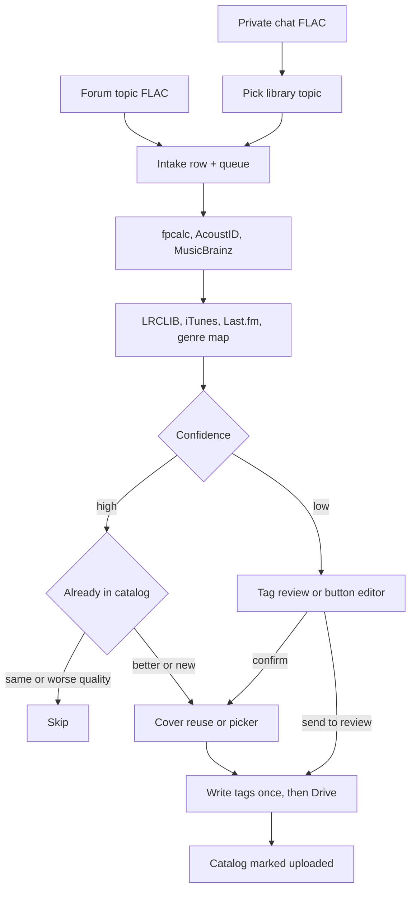
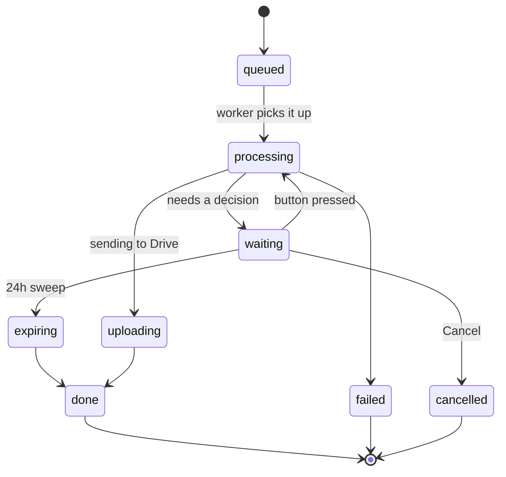

# Telegram FLAC tagger

Watches a Telegram forum group, fingerprints FLACs, writes a tight Vorbis-comment allowlist, uploads to Google Drive, and wipes local copies weekly.

Audio is never re-encoded. FLAC uses Vorbis comments (not ID3).

## What you need

1. Bot from [@BotFather](https://t.me/BotFather)
   - `/setprivacy` → **Disable** (otherwise the bot only sees commands)
   - Add the bot to the forum group. Grant **Photos** and **Files** (make it admin, or enable those in group permissions) — cover previews need them.
   - Keep it as an **admin**. Reaction updates (`message_reaction`) are only delivered to admins. Enable these group reactions: 👍 👎 💩 🙉 🙏 ✍️.
   - Keep it as an admin if using private chat. DM access is limited to current members of this forum and is checked with `getChatMember`.
2. `api_id` and `api_hash` from [my.telegram.org](https://my.telegram.org) (local Bot API, required for files over 20MB)
3. Free [AcoustID application key](https://acoustid.org/new-application)
4. MusicBrainz user-agent with a real contact email
5. Optional free [Last.fm API key](https://www.last.fm/api/account/create)
6. Google Cloud project (personal Drive)
   - Enable **Google Drive API**
   - OAuth consent: **External**, test user = your Gmail
   - Scopes to add: `drive.file` and `userinfo.email` (not full `drive` — that needs Google verification)
   - Credentials → OAuth client ID → **Desktop app**
   - Put `GOOGLE_CLIENT_ID` / `GOOGLE_CLIENT_SECRET` in `.env`
   - Run `python -m app.drive_auth` (or `--manual`)
   - Paste printed `GOOGLE_REFRESH_TOKEN`, `GDRIVE_FOLDER_ID`, `GDRIVE_REVIEW_FOLDER_ID`
   - Script creates **Telegram Music** and **Telegram Music Review**. Move them into your Music folder in Drive if you want; bot keeps access
   - Old folder IDs from before this app **will not work** (`drive.file` cannot see them)
   - Do **not** use a service account for personal My Drive

## Configure

```bash
cp .env.example .env
```

Paste secrets into `.env`. Service accounts are not supported — they have 0 My Drive quota.

Get `ALLOWED_CHAT_ID` by adding the bot and sending `/chatid` in the group. Forum General topic is usually `ALERT_THREAD_ID=1`. OAuth apps in **Testing** can expire the refresh token after ~7 days — re-run `python -m app.drive_auth` if uploads start failing with invalid_grant.

Only `FTP_USER`, `FTP_PASSWORD`, `FTP_PASV_ADDRESS` and the passive port range reach the ftp container. The rest of `.env` stays in the bot container.

## Run

```bash
docker compose up -d --build
docker compose logs -f bot
```

Local Bot API can take a minute to start; the bot retries.

Data:

- `/data/library` and `/data/review` — staging until weekly cleanup
- `/data/covers` — album art shortcut, deleted after 7 days
- `/data/pending` — FLACs parked while waiting on a review, cover pick, or Drive conflict
- `/data/tmp` — scratch space during tagging, wiped weekly
- `/data/state.sqlite` — catalog (survives wipes; used for dedup)
- Drive music folder — library layout `{Language}/{AlbumArtist}/{Album}/{AlbumArtist} - {Track} - {Title}.flac`
- Drive album folder also stores `cover.jpg`. First library track of an album sends a photo picker (file art, Cover Art Archive fronts, iTunes). Later tracks reuse that pick. Local copy expires after a week.
- Drive review folder — low-confidence matches plus a `.json` sidecar

Sunday 03:00 UTC (`CLEANUP_CRON`): retry failed uploads, alert General topic if still failing, delete locals that are confirmed on Drive, sweep leftover Bot API downloads, prune emptied Drive review folders, and drop finished rows older than 30 days.

The local Bot API server keeps every file it downloads. The bot deletes each one right after reading it, and the weekly sweep clears anything a crash left behind. Without that the volume grows by the full size of every FLAC ever posted.

## Architecture



Every pause is a row in `pending_reviews`. `phase` says what the bot is waiting for and `status` says who owns the row:



Rows in `queued`, `processing` or `uploading` at startup are re-driven by `recover_interrupted`, so a restart mid-job does not lose the file.

## Library FTPS

Read-only explicit FTPS of `library`, `review` and `covers`. Not SFTP.

Those three are mounted individually, so `state.sqlite` and `pending/` are not present in the ftp container at all.

Set `FTP_USER`, `FTP_PASSWORD`, and `FTP_PASV_ADDRESS` (the IP/DNS clients use to reach this host) in `.env`. The ftp container refuses to start if any of those are empty.

FileZilla: protocol **FTP**, encryption **explicit FTP over TLS**. Trust the self-signed cert on first connect. TLS 1.2 is the floor; very old clients will not connect.

Open **21/tcp** and the `FTP_PASV_MIN_PORT`–`FTP_PASV_MAX_PORT` range (default **21100–21110/tcp**) on the host firewall.

## Tags written

`TITLE`, `ALBUM`, `ARTIST`, `ALBUMARTIST`, `COMPOSER`, `GENRE`, `DATE`, `TRACKNUMBER`, `DISCNUMBER`, `LYRICS` (synced LRC only), one front cover. Everything else is stripped.

Artist fields use `A, B, C & D`. Genre is `genre | mood | language | instrument`.

Artist, album artist, and composer are compared as name sets, so a list that only differs in order counts as identical and never shows up as a tag difference. `;`, ` / `, and `feat.` / `ft.` / `featuring` in file tags are read as name separators (an unspaced slash like `AC/DC` stays one name). When only the order differs, the online credit order is written, which also keeps album folder names stable.

## Identification

1. Chromaprint / AcoustID (audio fingerprint)
2. MusicBrainz for canonical metadata
3. Cover Art Archive (release-group fronts) and iTunes album art. First library track of a named album pauses for a cover pick among distinct images (embedded file art, CAA, iTunes); later tracks reuse `cover.jpg` in the Drive album folder. No pick within 24h uses the first option and still goes to the library. Local copy expires after a week. Unknown / empty album names skip the picker and fetch per track.
4. LRCLIB for synced lyrics
5. iTunes + Last.fm tags filtered through `genre_map.yaml`

High AcoustID score and a single recording → library. Anything else pauses for review; forum flow can send it to the review folder, while private chat opens a button editor.

After a track is saved, react on the bot's info card (forum Saved message, or a card from `/review`):

- 👍 — confirm, then move to library (local + Drive)
- 👎 — confirm, then move to review (local + Drive)
- 💩 or 🙉 — confirm, then delete local + Drive
- 🙏 — confirm, then re-identify from the original Telegram file
- ✍️ — start the button editor. Removing ✍️ does **not** write Drive; it asks Cancel / Save draft / Commit to library. Cancel discards the session. Save draft writes Drive review. Commit to library writes Drive library.
- Removing 👍 👎 💩 🙉 🙏 does nothing.

## Private chat and Drive review

Current forum members can chat directly with the bot:

- Send a FLAC, then pick one of the forum topics. Bot uses that topic as the library folder and runs the same identification pipeline as a forum upload.
- High-confidence matches continue automatically. Low-confidence matches open a button editor (tap a field, type a value or pick a song.log suggestion).
- `/review` (alias `/reviews`) lists the review queue as `Artist — Album — Title`. Pick one to get a full info card, then react on that card.

Every private pre-save step has **Cancel**. Forum tag review, cover selection, and Drive-conflict prompts also have **Cancel**. Cancelling deletes only pending local files, not a saved library/review track.

## Development

Tests are stdlib `unittest` and need the runtime dependencies:

```bash
python -m venv .venv && .venv/bin/pip install -r requirements.txt
.venv/bin/python -m unittest discover -s tests -t .
```

Or inside the built image, which already has them:

```bash
docker compose run --rm --entrypoint python bot -m unittest discover -s tests -t .
```

Lint with `ruff check .` (config in `pyproject.toml`). Push and pull requests run the same lint + tests on GitHub Actions.

## Troubleshooting

**FTPS login works, then directory listing hangs.** `FTP_PASV_ADDRESS` is wrong or the passive port range is closed. It must be the address the *client* uses, not the container IP.

**ftp container restarts on a fresh install.** It mounts `library`, `review` and `covers` as volume subpaths, which must exist first. The bot creates them at startup and `ftp` waits on the bot's healthcheck, so this resolves itself; if it persists, check that the bot started.

**Uploads fail with `invalid_grant`.** The OAuth refresh token expired — apps left in **Testing** on the consent screen expire it after ~7 days. Re-run `python -m app.drive_auth`.

**Drive folder not visible.** `drive.file` only sees folders this app created. Old folder IDs will not work; run `python -m app.drive_auth --setup-folders` and paste the printed IDs.

**Cover picker shows no images.** The bot lacks permission to send photos in the group. Make it admin or enable Photos and Files, then use the preview links in the meantime.

**Bot API volume growing.** Should not happen anymore, but `docker compose exec bot du -sh /var/lib/telegram-bot-api` confirms it. The weekly cleanup sweeps anything older than a day.

## License

see [LICENSE](LICENSE).
